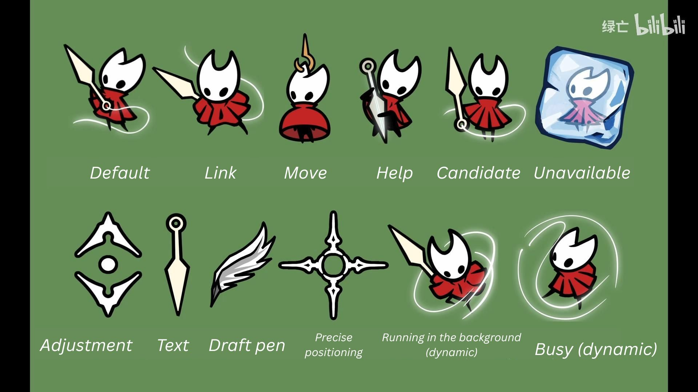
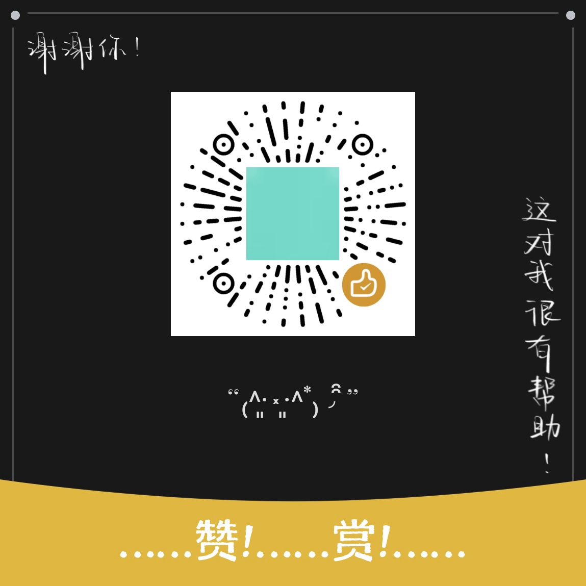

# Hornet Cursor Theme for Linux

[](https://opensource.org/licenses/MIT)
[](https://www.freedesktop.org/)



A Linux cursor theme of Hornet from *Hollow Knight: Sliksong*. All icons formatted as X11 cursors, available for GNOME, KDE Plasma, XFCE, etc. You can download this repo and install this theme by click the `installer.sh` file, or just download the `HornetCursor` folder and apply it by the instruction below.

---

## Quick start

### 1. Clone or download this repository:
```bash
git clone https://github.com/LanYang1214/HornetCursor-X11.git
cd HornetCursor-X11
```

### 2. Make the script executable and run it:
```bash
chmod +x install.sh
./install.sh
```

- Run by `sudo` to install by system-wide.

## Manual instruction

### 1. Installation Paths
Choose one of the following locations depending on your installation preference:

- User-Level (Applies only to your current user account, no `sudo` required):
    - Copy the `HornetCursor` folder to: `~/.local/share/icons/`
- System-Wide (Available to all users on the system, requires `sudo` / root permission):
    - Copy the `HornetCursor` folder to: `/usr/share/icons/`

### 2. How to Enable the Theme
Once the folder is placed in the correct location, you can activate the theme using either of the following methods:

#### A. Using GNOME Tweaks (GUI)
1. Open **GNOME Tweaks** (search for "Tweaks" in your application menu).
2. Navigate to **Appearance** in the left sidebar.
3. Locate **Cursor** in the right panel and select `HornetCursor` from the drop-down menu.

##### If GNOME Tweaks is not installed
You can install it using your distribution's package manager:

- Ubuntu / Debian: `sudo apt install gnome-tweaks`
- Fedora: `sudo dnf install gnome-tweaks`
- Arch Linux: `sudo pacman -S gnome-tweaks`

#### B. Using the Terminal (CLI)
Run the following command in your terminal to apply the theme instantly:
```bash
gsettings set org.gnome.desktop.interface cursor-theme 'HornetCursor'
```

### 5. FAQ

#### Q1: If Tweaks doesn't recognize the theme
This is usually caused by one of three common issues:

- Missing or Incorrect index.theme: Ensure /HornetCursor/index.theme exists, has the exact lowercase filename, and contains Name=HornetCursor.
- Incorrect Folder Hierarchy: The cursor icon files must be placed exactly inside /HornetCursor/cursors/. Make sure there are no extra nested folders (e.g., /HornetCursor/HornetCursor/cursors/).
- File Permissions: If installed system-wide in /usr/share/icons/, ensure all users have read and execute permissions: `sudo chmod -R 755 /usr/share/icons/HornetCursor`

#### Q2: If the cursor looks too small
You can change the cursor size using gsettings (common sizes are 32, 48, 64):
```bash

# Check current size (default is usually 24)
gsettings get org.gnome.desktop.interface cursor-size

# Set a larger size (e.g., 32 or 48)
gsettings set org.gnome.desktop.interface cursor-size 32
```

This setting is permanent and will persist after rebooting your system.

## Original Downloads & Other Platforms:

- [Windows Version (Original)](https://pan.baidu.com/s/1LKxQcAsivLwf8FbuhAxUdA?pwd=pprp): Includes `.cur`/`.ani` assets and an `.inf` auto-installer. The original download link is in the video description (in Chinese language, requires a Baidu drive account).
    - Or you can also use this [alternative Google Drive link](https://drive.google.com/drive/folders/17WQZ40U0zzfXlPnxbb55XIRvVIHACPKE), though file name is still in Chinese.
- [Mac Version](https://pan.quark.cn/s/940c022bb241?pwd=p5Sz): Adapted by an audience of the original video, posted in the comment section of it. File name in Chinese and requires a Quark drive account.

---

## Credits

- Original created by [绿亡](https://space.bilibili.com/362158444) on www.bilibili.com, [click here for the original post](https://www.bilibili.com/video/BV1rwntz7ETr)
- This adaption is created with permission of the original creator:


## Support the Creator! ❤️

If you enjoy this theme, please consider supporting the original author via WeChat Pay.



The author has created many other fantastic cursor themes, including The Knight (Hollow Knight) and Abigail from Don't Starve. Be sure to check out their original content!
